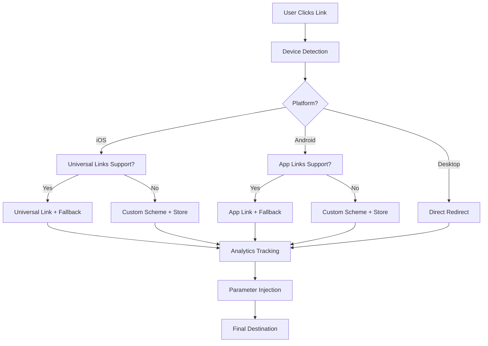

# 🚀 Universal Links - Smart Link Management Platform

[](https://rubyonrails.org/)
[](https://postgresql.org/)
[](LICENSE)
[](docs/DEPLOYMENT.md)

## Overview

**Universal Links** is a powerful, self-hosted Firebase Dynamic Links alternative built with Ruby on Rails 8. Create intelligent short links that automatically adapt to any platform, providing seamless deep linking experiences across iOS, Android, and web browsers.


## ✨ Key Features

### 🎯 **Smart Deep Linking**
- **iOS Universal Links** - Seamless app opening on iOS 9+
- **Android App Links** - Native deep linking on Android 6+
- **Custom Schemes** - Fallback support for all platforms
- **Intelligent Routing** - Automatic platform detection and optimal redirect strategy

### 📊 **Comprehensive Analytics**
- **Real-time Tracking** - Live click analytics and user behavior
- **Platform Insights** - Device, OS, and browser breakdowns
- **Geographic Data** - Country-level click distribution
- **Interactive Charts** - Beautiful Chart.js visualizations
- **Export Capabilities** - Data export and reporting tools

### 🎨 **Modern Dashboard**
- **Responsive Design** - Works perfectly on desktop and mobile
- **Real-time Search** - Instant link filtering and discovery
- **Bulk Operations** - Manage multiple links efficiently
- **Collapsible UI** - Organized, space-efficient interface

### 🔧 **Advanced Configuration**
- **Auto-Parameter Injection** - UTM tracking, device params, custom variables
- **Social Media Integration** - Rich Open Graph and Twitter Card support
- **Platform-Specific Settings** - iOS, Android, and web configurations
- **Custom Domains** - White-label your short links (production ready)

### 🛡️ **Enterprise Ready**
- **Self-Hosted** - Complete control over your data and infrastructure
- **Production Deployment** - Systemd services, Nginx configuration
- **SSL/HTTPS** - Secure by default with Let's Encrypt support
- **Monitoring & Logging** - Comprehensive observability tools

## 🚀 Quick Start

### **Prerequisites**
- Ruby 3.2.0+
- PostgreSQL 12+
- Node.js (for asset pipeline)

### **Installation**
```bash
# Clone the repository
git clone https://github.com/tuhalang/universal_links.git
cd universal_links

# Install dependencies
bundle install

# Setup database
rails db:create db:migrate db:seed

# Start development server
rails server
```

### **Demo Account**
A demo user account is automatically created during database setup:

```
Email: demo@utilsawesome.com
Password: admin123
Role: User (not admin)
```

**Features Available:**
- ✅ Create and manage your own dynamic links
- ✅ View detailed analytics for your links
- ✅ Edit and customize link configurations
- ✅ Access all user-level features
- ❌ No admin privileges (cannot see other users' links)

### **First Link**
1. Open http://localhost:3000
2. Login with demo credentials or register a new account
3. Click "Create New Link"
4. Configure your target URL and platform settings
5. Share your smart link and watch the analytics!

## 📚 Documentation

| Document | Description |
|----------|-------------|
| **[Features Guide](docs/FEATURES.md)** | Comprehensive feature documentation with examples |
| **[API Reference](docs/API.md)** | REST API endpoints and integration guide |
| **[Deployment Guide](docs/DEPLOYMENT.md)** | Production deployment with systemd and nginx |

## 🛠️ Technology Stack

- **Backend**: Ruby on Rails 8.0.2
- **Database**: PostgreSQL with optimized indexing
- **Frontend**: Tailwind CSS + Stimulus + Turbo
- **Analytics**: Chart.js with real-time updates
- **Device Detection**: Advanced user-agent parsing
- **Security**: HTTPS enforcement, CSRF protection

## 🎯 Use Cases

### **Mobile App Marketing**
Create smart links that route users to your iOS/Android apps or web alternatives:
```
https://yoursite.com/abc123
├── iOS → Opens App Store or your app directly
├── Android → Opens Play Store or your app directly  
└── Desktop → Redirects to web landing page
```

### **Social Media Campaigns**
Rich preview cards with custom images and descriptions:
```html
<meta property="og:title" content="Download Our Amazing App!">
<meta property="og:description" content="Join millions of users...">
<meta property="og:image" content="https://yoursite.com/preview.jpg">
```

### **Cross-Platform Content**
Single link that works everywhere with automatic parameter injection:
```
Target URL: https://myapp.com/content
Enhanced:   https://myapp.com/content?utm_source=ios_app&dl_device=smartphone&campaign=summer_sale
```

## 📈 Analytics Dashboard

Track everything that matters:

- **📊 Click Trends** - Daily, weekly, monthly analytics
- **📱 Platform Distribution** - iOS vs Android vs Desktop
- **🌍 Geographic Data** - See where your audience is located
- **🔗 Link Performance** - Compare link effectiveness
- **⏱️ Real-time Data** - Live click tracking and updates

## 🔗 Smart Redirect Flow



## 🚀 Production Deployment

Deploy to your own server with our comprehensive deployment guide:

```bash
# Quick production setup
sudo systemctl enable universal-links
sudo systemctl start universal-links

# With nginx reverse proxy
sudo cp deploy/nginx.conf /etc/nginx/sites-available/
sudo systemctl reload nginx

# SSL with Let's Encrypt
sudo certbot --nginx -d yourdomain.com
```

**See [Deployment Guide](docs/DEPLOYMENT.md) for complete instructions.**

## 📊 Performance & Scale

- **High Performance**: Optimized database queries and caching
- **Scalable Architecture**: Horizontal scaling ready
- **CDN Support**: Static asset optimization
- **Monitoring Ready**: Prometheus, Grafana integration

## 🔐 Security Features

- **HTTPS Enforcement** - Secure by default
- **CSRF Protection** - Cross-site request forgery prevention
- **Input Validation** - SQL injection and XSS protection
- **Origin Validation** - Trusted host verification
- **Rate Limiting** - Built-in abuse prevention

## 🎯 Feature Comparison

| Feature | Universal Links | Firebase Dynamic Links | Bitly |
|---------|-----------------|------------------------|-------|
| Self-Hosted | ✅ | ❌ | ❌ |
| Custom Domains | ✅ | ✅ | ✅ Premium |
| iOS Deep Linking | ✅ | ✅ | ❌ |
| Android App Links | ✅ | ✅ | ❌ |
| Analytics Dashboard | ✅ | ✅ | ✅ |
| Unlimited Links | ✅ | ❌ Paid | ❌ Paid |
| Open Source | ✅ | ❌ | ❌ |
| API Access | 🔜 | ✅ | ✅ |

## 🤝 Contributing

We welcome contributions! Here's how you can help:

1. **Fork the repository**
2. **Create a feature branch** (`git checkout -b feature/amazing-feature`)
3. **Commit your changes** (`git commit -m 'Add amazing feature'`)
4. **Push to the branch** (`git push origin feature/amazing-feature`)
5. **Open a Pull Request**

### **Development Setup**
```bash
# Install development dependencies
bundle install --with development test

# Run tests
rails test

# Run linting
rubocop

# Start with live reload
rails server
```

## 📝 License

This project is licensed under the MIT License - see the [LICENSE](LICENSE) file for details.

## 🙏 Acknowledgments

- **Rails Team** - For the amazing Rails 8 framework
- **Tailwind CSS** - For the beautiful styling system
- **Chart.js** - For powerful analytics visualizations
- **Device Detector** - For accurate device detection
- **PostgreSQL** - For reliable data storage

## 📞 Support

- **📖 Documentation**: Comprehensive guides in `/docs`
- **🐛 Issues**: [GitHub Issues](https://github.com/tuhalang/universal_links/issues)
- **💬 Discussions**: [GitHub Discussions](https://github.com/tuhalang/universal_links/discussions)
- **📧 Email**: Support via GitHub issues preferred

## 🔮 Roadmap

### **Coming Soon**
- [ ] **REST API** - Full programmatic access
- [ ] **Webhooks** - Real-time event notifications
- [ ] **QR Codes** - Visual link sharing
- [ ] **A/B Testing** - Built-in link variation testing
- [ ] **Team Management** - Multi-user access controls
- [ ] **Bulk Operations** - CSV import/export
- [ ] **Advanced Analytics** - Funnel analysis, cohorts

### **Future Releases**
- [ ] **Mobile SDKs** - iOS and Android integration libraries
- [ ] **Browser Extension** - Quick link creation
- [ ] **Zapier Integration** - Workflow automation
- [ ] **Custom Dashboards** - Personalized analytics views

---

**Built with ❤️ by [tuhalang](https://github.com/tuhalang) using Ruby on Rails 8**

[](https://github.com/tuhalang/universal_links)
[](https://github.com/tuhalang/universal_links/fork)
